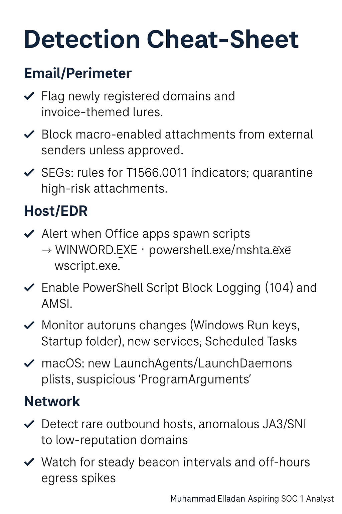

# Mini-Project: Phishing → Ransomware (Kill Chain + MITRE ATT&CK)

A compact blue-team mini-project: map a phishing-to-ransomware attack across the **Cyber Kill Chain** and **MITRE ATT&CK**, then summarize practical detections in a one-page cheat-sheet.

> 📄 One-pager (PDF): [docs/Phishing_Ransomware_Cheat_Sheet.pdf](docs/Phishing_Ransomware_Cheat_Sheet.pdf)  
> 🖼️ One-pager (PNG): 

---

## Attack Scenario

An attacker sends a phishing email with a malicious **“Invoice”** Word document. The victim downloads the file and **enables macros**, which launches a script that pulls down the ransomware payload, establishes C2, and encrypts local (and possibly network) files.

---

## Cyber Kill Chain Mapping (with detection ideas)

| Kill Chain Phase | Description in this Attack | Practical Detection Ideas |
| --- | --- | --- |
| **Reconnaissance** | Adversary collects staff emails and org details (company site, LinkedIn) to craft believable lures. | Monitor for **typosquat/look-alike domains**; enable brand/domain monitoring; user reports of suspicious “invoice” emails. |
| **Weaponization** | Malicious **.docm** crafted with embedded **VBA macro** / script dropper. | Sandbox suspicious docs; static analysis for **auto-open macros**, obfuscated VBA, and LOLBIN calls (e.g., `powershell`, `mshta`). |
| **Delivery** | Phishing email with attachment sent to targets. | Secure email gateway rules for **T1566.001** patterns; block/flag **newly registered domains**; quarantine executables in archives. |
| **Exploitation** | User opens file and **enables macros** → script executes. | Alert on **Office spawning cmd/powershell** (parent = `WINWORD.EXE`); PowerShell **Script Block Logging (4104)**; AMSI hits; EDR detections. |
| **Installation (Persistence/Load)** | Dropper downloads payload; sets persistence (e.g., **LaunchAgents** on macOS or **Run keys/Startup** on Windows); schedules task/service. | Watch for **autorun changes** (Windows **Run/RunOnce** keys), **Scheduled Tasks**, **new services**, or macOS **LaunchAgents/LaunchDaemons**; Sysmon **Event ID 13** (registry set), **ID 1** (process create). |
| **C2 (Command & Control)** | Ransomware/droppers beacon to remote server over **encrypted channel** (e.g., HTTPS/custom TCP). | Detect **rare external destinations**, abnormal **JA3/SNI**, unusual **HTTPS to new domains**, off-hours beacons; proxy/DNS logs for spikes. |
| **Actions on Objectives (Impact)** | **File encryption**; possible **shadow copy deletion** to block recovery; ransom note dropped. | Alert on `vssadmin delete shadows`, `wbadmin`, `bcdedit`; detect **mass file modifications/renames**, sudden entropy spikes, and ransom-note creation bursts. |

---

## MITRE ATT&CK Cross-Map

- **Reconnaissance** → **T1591** (Gather Victim Org Information), **T1598** (Phishing for Information)  
- **Weaponization (Pre-ATT&CK)** → **T1587.001** (Develop Capabilities: Malware)  
- **Delivery** → **T1566.001** (Spearphishing Attachment) _(use **.002** if it’s a link instead)_  
- **Execution** → **T1204.002** (User Execution: Malicious File), **T1059.001** (Power

> 🖼️ Detection Cheet Sheet (PNG): 
